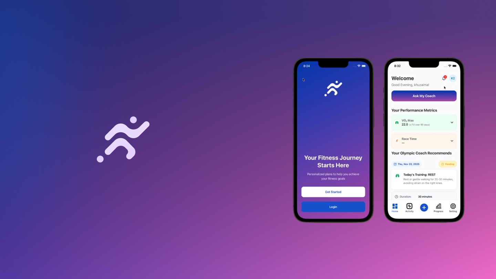
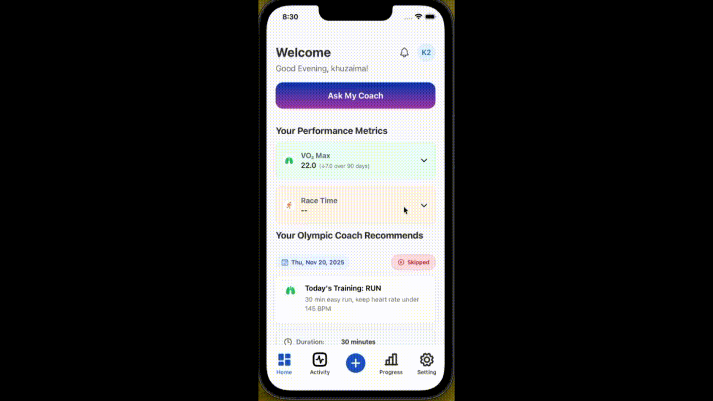

# StrideIQ Mobile App 🏃‍♂️

<div align="center">
  
  
  **A comprehensive React Native + Expo mobile application for intelligent fitness tracking, AI-powered coaching, and Apple Watch integration.**
  
  
  
  
  
  

</div>

## 📱 App Screenshot

<!-- TODO: Add app screenshots here -->
*Screenshots will be added here showing the main dashboard, onboarding flow, and health data visualization.*

## ✨ Key Features

### 🏥 Advanced Health Integration
- **Apple HealthKit Integration** - Real-time health data from Apple Watch & iPhone
- **Heart Rate Monitoring** - Continuous heart rate tracking and analytics
- **VO₂ Max Analysis** - Cardio fitness assessments and trends
- **Workout Tracking** - Comprehensive exercise logging and history
- **Step Counter** - Daily activity and movement tracking

### 🤖 AI-Powered Coaching
- **Personalized Recommendations** - AI-generated training suggestions
- **Daily Check-ins** - Smart health assessments with real-time insights
- **Performance Analytics** - Data-driven coaching recommendations
- **Goal Optimization** - Intelligent race time and fitness goal adjustments

#### 🎥 AI Coach Interface Demo

<div align="center">
  
  <p><em>Interactive AI Coach providing personalized training recommendations and real-time health insights</em></p>
</div>

> **Note:** If the GIF doesn't load, you can view the full video demo at [`./assets/images/coach.mp4`](./assets/images/coach.mp4)

### 👤 Smart Onboarding
- **Progressive User Setup** - 11-step guided onboarding process
- **Health Metrics Collection** - Comprehensive fitness and medical history
- **Goal Setting** - Personalized training objectives
- **Device Integration** - Seamless Apple Watch pairing

### 📊 Real-time Dashboard
- **Health Metrics Overview** - Live data from connected devices
- **Activity Visualization** - Charts and graphs for progress tracking
- **Sync Management** - Real-time backend synchronization
- **Notification Center** - Smart alerts and reminders

## 🏗️ Architecture

### Tech Stack
- **Framework**: React Native 0.81.4 + Expo SDK 54
- **Language**: TypeScript 5.0+
- **Navigation**: Expo Router v6 (file-based routing)
- **State Management**: Redux Toolkit with Redux Persist
- **UI Components**: Custom design system with Expo Vector Icons
- **Backend Integration**: RESTful API with typed client
- **Health Integration**: react-native-health for HealthKit
- **Watch Connectivity**: react-native-watch-connectivity

### Project Structure

```
strideiq_mobile_app/
├── 📱 app/                          # Expo Router file-based routing
│   ├── (onboarding)/               # Onboarding flow (11 screens)
│   │   ├── _layout.tsx            # Onboarding layout wrapper
│   │   ├── index.tsx              # Welcome screen
│   │   ├── name-screen.tsx        # Name collection
│   │   ├── gender-screen.tsx      # Gender selection
│   │   ├── birthday-screen.tsx    # Age verification
│   │   ├── weight-screen.tsx      # Weight & body metrics
│   │   ├── height-screen.tsx      # Height measurement
│   │   ├── goals-screen.tsx       # Fitness goals
│   │   ├── fitness-screen.tsx     # Current fitness level
│   │   ├── medical-screen.tsx     # Medical conditions
│   │   ├── moods-screen.tsx       # Mood tracking setup
│   │   └── final-onboarding.tsx   # Completion
│   ├── (tabs)/                    # Main app navigation
│   │   ├── _layout.tsx            # Tab bar configuration
│   │   ├── index.tsx              # Dashboard (home)
│   │   ├── activity.tsx           # Health data & analytics
│   │   ├── metrics.tsx            # Performance metrics
│   │   ├── add.tsx                # Manual data entry
│   │   └── settings.tsx           # User preferences
│   ├── dashboard/                 # Dashboard sub-screens
│   └── settings/                  # Settings sub-screens
├── 🧩 src/                         # Source code organization
│   ├── components/                # Shared React components
│   │   ├── DailyCheckInModal.tsx  # AI check-in interface
│   │   ├── HealthKitDataDisplay.tsx # Real-time health data
│   │   └── ClerkApiSync.tsx       # Authentication sync
│   ├── features/                  # Feature-based modules
│   │   ├── health/               # HealthKit integration
│   │   │   └── healthKit.ts      # Apple Health API wrapper
│   │   └── watch/                # Apple Watch connectivity
│   │       └── ExampleWatchUsage.tsx
│   ├── hooks/                    # Custom React hooks
│   │   ├── useOnboarding.ts      # Onboarding state management
│   │   ├── useCoachingRecommendations.ts # AI coaching
│   │   └── useWarmUpBrowser.ts   # OAuth browser warming
│   ├── lib/                      # Shared utilities
│   │   ├── api.ts               # API client & configuration
│   │   ├── apiClient.ts         # Typed HTTP client
│   │   ├── healthSync.ts        # Health data synchronization
│   │   ├── onboardingProgress.ts # Progress persistence
│   │   ├── theme.ts             # Design system tokens
│   │   └── WatchConnectivity.ts  # Watch communication
│   ├── store/                    # Redux state management
│   │   ├── index.ts             # Store configuration
│   │   ├── selectors/           # Redux selectors
│   │   ├── slices/              # Feature slices
│   │   │   ├── authSlice.ts
│   │   │   ├── profileSlice.ts
│   │   │   ├── deviceSlice.ts
│   │   │   ├── onboardingSlice.ts
│   │   │   └── recommendationsSlice.ts
│   │   └── thunks/              # Async actions
│   ├── types/                    # TypeScript definitions
│   ├── ui/                       # Reusable UI primitives
│   │   ├── Button.tsx           # Button component system
│   │   ├── Text.tsx             # Typography system
│   │   ├── modal.tsx            # Modal primitives
│   │   └── top-stepbar.tsx      # Progress indicators
│   └── utils/                    # Utility functions
├── 🎨 assets/                     # Static assets
│   ├── images/                   # App icons & splash screens
│   ├── dashboard/                # Dashboard-specific assets
│   ├── onboarding/              # Onboarding visuals
│   ├── genders/                 # Gender selection icons
│   ├── moods/                   # Mood tracking icons
│   ├── devices/                 # Device connection assets
│   └── socials/                 # Social login assets
├── 🔧 plugins/                    # Expo config plugins
│   └── withHealthKit.js         # HealthKit capability plugin
└── 📄 Documentation
    ├── HEALTHKIT_SETUP.md       # HealthKit integration guide
    ├── HEALTHKIT_INTEGRATION.md # Comprehensive health docs
    └── HEALTHKIT_SETUP_STEPS.md # Step-by-step setup
```

### State Management Architecture

```typescript
// Redux Store Structure
{
  auth: {
    user: User | null;
    isAuthenticated: boolean;
    isLoading: boolean;
  };
  profile: {
    data: ProfileData;
    hasCompletedProfile: boolean;
    isLoading: boolean;
  };
  onboarding: {
    currentStep: number;
    formData: OnboardingData;
    savedSteps: number[];
    pendingSync: boolean;
  };
  device: {
    connectedDevices: Device[];
    selectedDeviceId: string;
  };
  recommendations: {
    data: Recommendation[];
    isLoading: boolean;
    lastUpdated: string;
  };
}
```

### API Architecture

```typescript
// API Client Structure
class ApiClient {
  baseURL: string;
  headers: Record<string, string>;
  
  async get<T>(endpoint: string): Promise<ApiResponse<T>>;
  async post<T>(endpoint: string, data: any): Promise<ApiResponse<T>>;
  async put<T>(endpoint: string, data: any): Promise<ApiResponse<T>>;
  async delete<T>(endpoint: string): Promise<ApiResponse<T>>;
}

// Health Data Sync Flow
Apple Watch → iPhone Health → HealthKit → React Native → Backend API
```

## 🚀 Getting Started

### Prerequisites
- **Node.js** 18.0+ 
- **npm** or **yarn**
- **iOS Development Environment** (macOS + Xcode for iOS builds)
- **Expo CLI** (`npm install -g @expo/cli`)
- **Physical iOS Device** (HealthKit requires real device, not simulator)

### Installation

1. **Clone the repository**
```bash
git clone https://github.com/redhawk5200/strideiq_mobile_app-main.git
cd strideiq_mobile_app-main
```

2. **Install dependencies**
```bash
npm install
```

3. **Install iOS dependencies**
```bash
cd ios && pod install && cd ..
```

4. **Start development server**
```bash
npx expo start
```

5. **Run on device** (iOS only for HealthKit)
```bash
# For iOS physical device (required for HealthKit)
npx expo run:ios --device

# For iOS simulator (limited functionality)
npx expo run:ios

# For Android (no HealthKit support)
npx expo run:android
```

### Environment Setup

Create `.env` file in root directory:
```env
# API Configuration
API_BASE_URL=https://stride-api.edgefirm.io
API_VERSION=v1

# Clerk Authentication (Optional)
EXPO_PUBLIC_CLERK_PUBLISHABLE_KEY=your_clerk_key_here

# Development
NODE_ENV=development
```

## 📱 Core Features

### 1. Health Data Integration

#### Apple HealthKit Integration
```typescript
import { healthKitManager } from './src/features/health/healthKit';

// Initialize HealthKit
const success = await healthKitManager.initialize();

// Get real-time health data
const heartRate = await healthKitManager.getLatestHeartRate();
const steps = await healthKitManager.getDailySteps();
const vo2Max = await healthKitManager.getLatestVO2Max();
const workouts = await healthKitManager.getWorkouts(startDate);
```

**Supported Health Metrics:**
- ❤️ Heart Rate (resting, active, recovery)
- 🫁 VO₂ Max (cardio fitness)
- 🚶 Daily Steps & Distance
- 🏋️ Workout Sessions
- ⚡ Heart Rate Variability (HRV)
- 🔥 Active Energy Burned

### 2. AI-Powered Daily Check-ins

```typescript
// Daily Check-in Modal with AI Recommendations
<DailyCheckInModal 
  visible={showCheckIn}
  onClose={() => setShowCheckIn(false)}
/>
```

**AI Features:**
- Real-time health data analysis
- Personalized training recommendations  
- Recovery and rest day suggestions
- Goal progression tracking
- Performance optimization tips

### 3. Comprehensive Onboarding

**11-Step Progressive Setup:**
1. **Welcome & Setup Profile** - Initial app introduction
2. **Name Collection** - Personal identification
3. **Gender Selection** - Physiological considerations
4. **Birthday Entry** - Age-based recommendations
5. **Weight Tracking** - Body composition baseline
6. **Height Measurement** - BMI and health calculations
7. **Goals Setting** - Fitness objectives and targets
8. **Fitness Assessment** - Current activity level
9. **Medical History** - Health conditions and limitations
10. **Mood Tracking** - Mental health integration
11. **Training Preferences** - Workout style and schedule

### 4. Apple Watch Connectivity

```typescript
import WatchConnectivity from './src/lib/WatchConnectivity';

// Start workout on Apple Watch
WatchConnectivity.startWorkout('running', 1800); // 30 minutes

// Listen for real-time heart rate updates
WatchConnectivity.onHeartRateUpdate((data) => {
  console.log(`Heart Rate: ${data.heartRate} BPM`);
});

// Sync user settings to watch
WatchConnectivity.syncUserSettings({
  targetHeartRate: 150,
  workoutGoals: { dailySteps: 10000 }
});
```

## 🔗 API Integration

### Backend Endpoints

```typescript
// Health Data Sync
POST /api/v1/health/heart-rate/batch
POST /api/v1/health/steps/batch  
POST /api/v1/health/vo2-max/batch
POST /api/v1/health/workouts/batch

// AI Recommendations
GET  /api/v1/recommendations/generate
GET  /api/v1/recommendations/quick-actions
POST /api/v1/recommendations/feedback

// User Management
GET  /api/v1/user/profile
PUT  /api/v1/user/profile
GET  /api/v1/user/onboarding-progress
PUT  /api/v1/user/onboarding-progress

// Analytics
GET  /api/v1/analytics/dashboard
GET  /api/v1/analytics/trends
```

### Data Models

```typescript
interface HealthMetrics {
  heartRate: number | null;
  vo2Max: number | null;
  dailySteps: number;
  activeCalories: number;
  workoutsThisWeek: number;
  lastSync: string;
}

interface AIRecommendation {
  title: string;
  description: string;
  category: 'vo2' | 'race' | 'training' | 'recovery';
  priority: 'high' | 'medium' | 'low';
  actionItems?: string[];
}

interface OnboardingProgress {
  currentStep: number;
  completedSteps: number[];
  formData: OnboardingData;
  isCompleted: boolean;
}
```

## 🏥 HealthKit Setup

### Quick Start
1. **Physical iOS device required** (HealthKit doesn't work in simulator)
2. **Enable HealthKit capability in Xcode**
3. **Grant health permissions in iOS Settings**
4. **Pair Apple Watch for optimal data**

### Detailed Setup
See [`HEALTHKIT_SETUP.md`](./HEALTHKIT_SETUP.md) for comprehensive setup instructions.

**Key Files:**
- `src/features/health/healthKit.ts` - Main HealthKit wrapper
- `src/lib/healthSync.ts` - Backend synchronization
- `plugins/withHealthKit.js` - Expo config plugin

## 🧪 Testing

### Running Tests
```bash
# Unit tests
npm test

# iOS simulator testing
npm run ios

# Android emulator testing  
npm run android

# Web testing (limited functionality)
npm run web
```

### Test Coverage
- ✅ Component unit tests
- ✅ Redux store testing
- ✅ API client testing  
- ✅ HealthKit mock testing
- ⏳ E2E testing (planned)

## 🚀 Deployment

### EAS Build Configuration
```json
// eas.json
{
  "build": {
    "development": {
      "ios": {
        "resourceClass": "m-medium",
        "bundleIdentifier": "com.redhawk5200.strideiq.dev"
      }
    },
    "production": {
      "ios": {
        "resourceClass": "m-medium", 
        "bundleIdentifier": "com.redhawk5200.strideiq"
      }
    }
  }
}
```

### Build Commands
```bash
# Development build
eas build --platform ios --profile development

# Production build  
eas build --platform ios --profile production

# Submit to App Store
eas submit --platform ios
```

## 📖 Documentation

### Health Integration Guides
- [`HEALTHKIT_SETUP.md`](./HEALTHKIT_SETUP.md) - Quick setup guide
- [`HEALTHKIT_INTEGRATION.md`](./HEALTHKIT_INTEGRATION.md) - Comprehensive integration docs
- [`HEALTHKIT_SETUP_STEPS.md`](./HEALTHKIT_SETUP_STEPS.md) - Step-by-step troubleshooting

### Development Guidelines
- [`.github/copilot-instructions.md`](./.github/copilot-instructions.md) - Coding standards
- [`.github/prompts/`](./.github/prompts/) - Development templates

## 🤝 Contributing

### Development Workflow
1. Fork the repository
2. Create feature branch (`git checkout -b feature/amazing-feature`)
3. Follow coding standards in `copilot-instructions.md`
4. Test on physical iOS device for HealthKit features
5. Submit pull request

### Code Style
- **TypeScript** strict mode enabled
- **ESLint + Prettier** for code formatting
- **Component-driven architecture** with reusable UI primitives
- **Feature-based organization** in `src/features/`

## 📊 Performance

### Optimization Features
- ✅ **Redux Toolkit** for efficient state management
- ✅ **React Native Reanimated** for smooth animations  
- ✅ **Expo Router** for performant navigation
- ✅ **Async data loading** with proper loading states
- ✅ **Background sync** for health data
- ✅ **Optimistic updates** for better UX

### Health Data Sync Performance
- **Batch uploads** for efficient API usage
- **Incremental sync** to avoid duplicate data
- **Background processing** for seamless UX
- **Retry mechanisms** for network reliability

## 📄 License

This project is licensed under the MIT License - see the [LICENSE](LICENSE) file for details.

## 🙋‍♂️ Support

### Getting Help
- **GitHub Issues** - Bug reports and feature requests
- **Documentation** - Comprehensive guides in `/docs` folder  
- **HealthKit Issues** - Check `HEALTHKIT_SETUP.md` first

### Contact
- **Developer**: [@redhawk5200](https://github.com/redhawk5200)
- **Repository**: [strideiq_mobile_app-main](https://github.com/redhawk5200/strideiq_mobile_app-main)

---

<div align="center">
  <p>Built with ❤️ using React Native, Expo, and Apple HealthKit</p>
  <p>🏃‍♂️ <strong>StrideIQ - Intelligent Fitness Tracking</strong> 🏃‍♀️</p>
</div>
